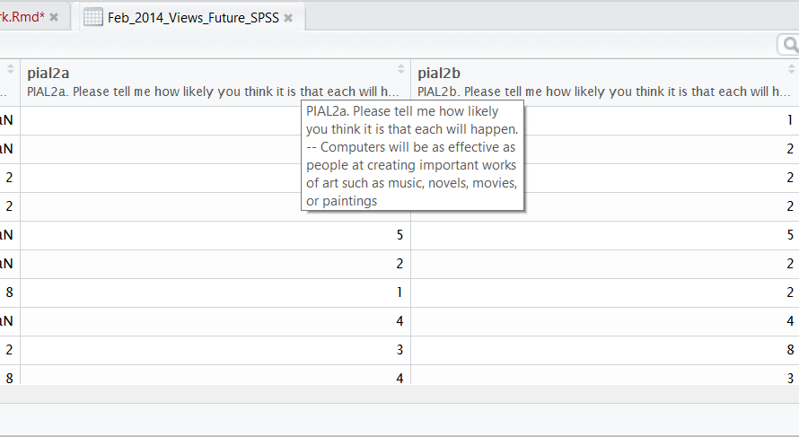
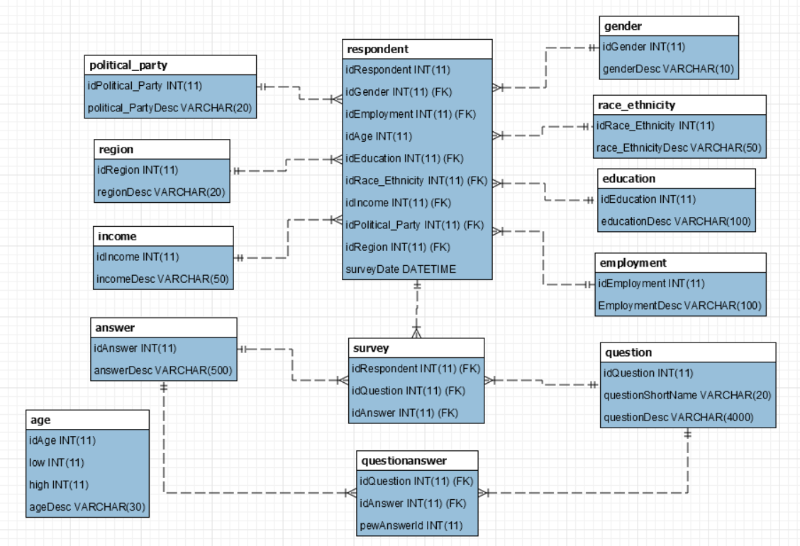
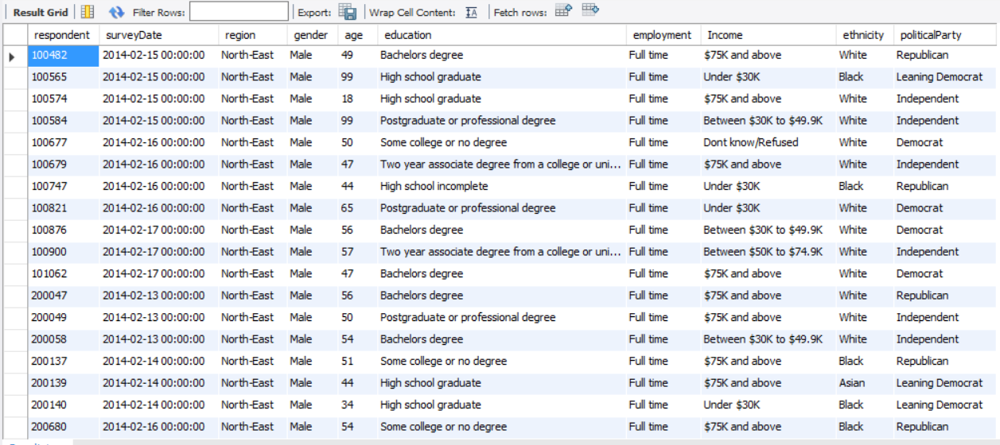
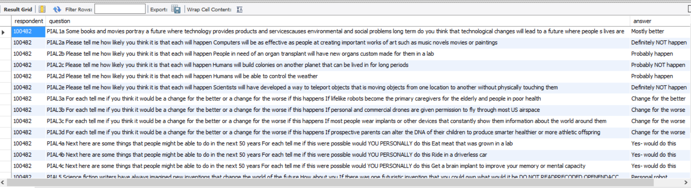
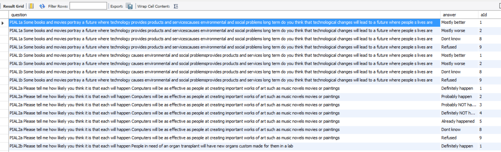
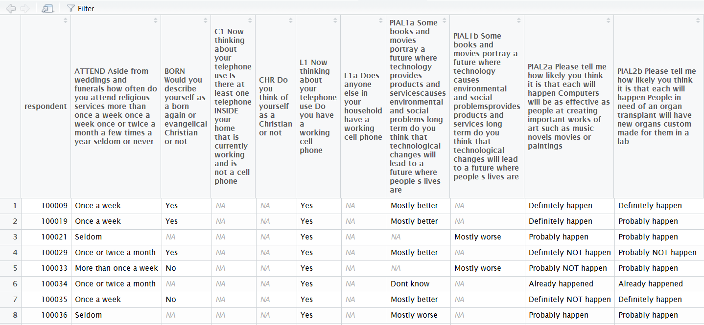
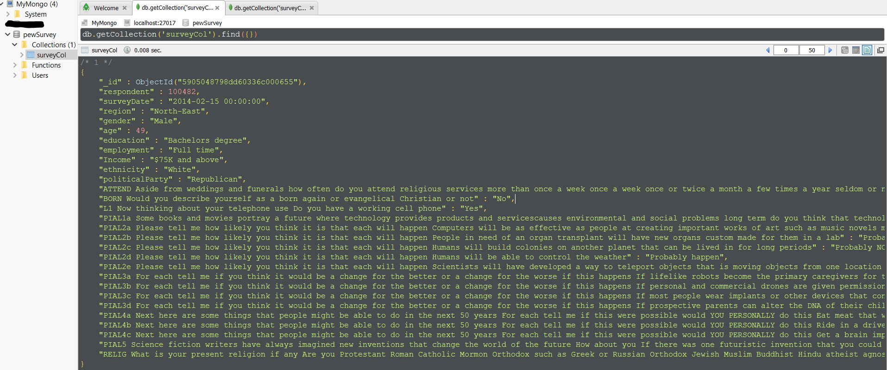
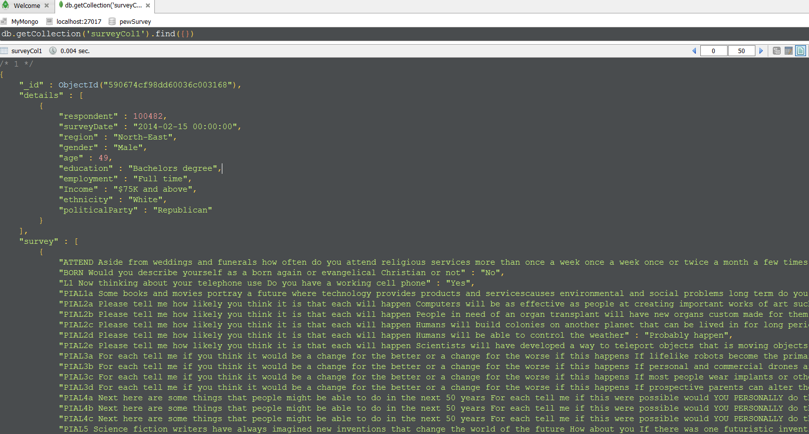
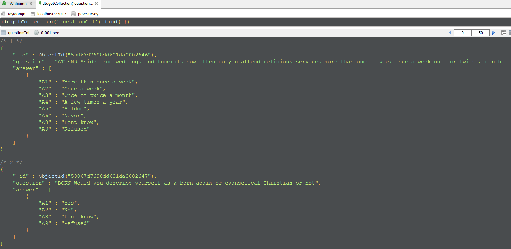

##Abstract

The goal of this assignment is to take information from a relational database and migrate it to a NoSQL database. To showcase migration process **_relational database - MySQL_** and **_NoSQL database - MongoDB_** are used. Migration process is done using `R`.

Libraries used.

```{r, echo=T, warning=F, message=F}
library(haven)      #loading .sav file
library(tidyr)      #spread() and gather() functions
library(stringr)    #string functions
library(dplyr)      #grammar and data manipulation
library(RMySQL)     #connecting to MySQL and performing db function
library(mongolite)  #connecting to MongoDB
library(knitr)
library(jsonlite)   #converting data into JSON
```

##Data Source

Pew Research Center and Smithsonian magazine conducted a national survey **_U.S. Views of Technology and the Future_** which asked Americans about a wide range of potential scientific developments from near-term advances like robotics and bioengineering, to more "futuristic" possibilities like teleportation or space colonization. More information can be found at [*Pew Research website.*](http://www.pewinternet.org/2014/04/17/us-views-of-technology-and-the-future/) 

Data used is sample dataset. For the scope of the assignment, some data values are interpreted based on assumption. SAV file provided by Pew Research Center contains survey data and questions associated with the response.
\
\


##Populate Relational Database - MySQL

Create SQL tables using `pewSurvey.sql`. Following diagram explains the relationship between tables. Table `respondent` is the master table that contains attributes of a person responded to the survey. Definition of each attribute is stored in associated dimension tables. Tables have `primary key` and `foreign key` relationship.
\
\

\
\

```{r, echo=T, warning=F, message=F}
#Function to cleanup data
pewCleanData <- function(x){
  x <- gsub("[[:punct:]]", "", x) # Replace junk with ("")
  x <- iconv(x, "latin1", "ASCII", sub=" ")
  x <- gsub("\\s+", " ", x) # Remove double spaces
  return(x)
}

#Convert to proper date format
properDate <- function(x){
  m <- str_sub(paste0("0", substr(x,1,1)), -2) #Get last 2 digits
  y <- paste0("20", substr(x,4,5))
  d <- paste0(y, "-", m, "-", substr(x,2,3), " 00:00:00")
  return(d)
}

dataFilePath <- "D:/CUNY/607/Week13/" #Change path

#dataFilePath <- "https://github.com/akulapa/Akula-DATA607-Week13-Homework/"

#Read data from sav files
pew.data <- read_sav(paste0(dataFilePath,"Feb_2014_Views_Future_SPSS.sav"))

#Answer codes
pew.answers <- read.csv(file = paste0(dataFilePath,"Answers.csv"), header=TRUE, sep=",", stringsAsFactors = F)

#Read all deminsion related files
pew.age <- read.csv(file = paste0(dataFilePath,"Age.csv"), header=TRUE, sep=",", stringsAsFactors = F)
pew.education <- read.csv(file = paste0(dataFilePath,"Education.csv"), header=TRUE, sep=",",  stringsAsFactors = F)
pew.employment <- read.csv(file = paste0(dataFilePath,"Employment.csv"), header=TRUE, sep=",", stringsAsFactors = F)
pew.gender <- read.csv(file = paste0(dataFilePath,"Gender.csv"), header=TRUE, sep=",", stringsAsFactors = F)
pew.income <- read.csv(file = paste0(dataFilePath,"Income.csv"), header=TRUE, sep=",", stringsAsFactors = F)
pew.party <- read.csv(file = paste0(dataFilePath,"Political_Party.csv"), header=TRUE, sep=",", stringsAsFactors = F)
pew.ethnicity <- read.csv(file = paste0(dataFilePath,"Race_Ethnicity.csv"), header=TRUE, sep=",", stringsAsFactors = F)
pew.region <- read.csv(file = paste0(dataFilePath,"Region.csv"), header=TRUE, sep=",", stringsAsFactors = F)

#Extract questions, they are saved in attribute value
pew.questions <- data.frame(NA,NA,NA, stringsAsFactors = F)
colnames(pew.questions) <- c("question", "qlabel", "questionId")
pew.questions <- rbind(pew.questions, c(attr(pew.data$pial1a,'label'), "pial1a", 1))
pew.questions <- rbind(pew.questions, c(attr(pew.data$pial1b,'label'), "pial1b", 2))
pew.questions <- rbind(pew.questions, c(attr(pew.data$pial2a,'label'), "pial2a", 3))
pew.questions <- rbind(pew.questions, c(attr(pew.data$pial2b,'label'), "pial2b", 4))
pew.questions <- rbind(pew.questions, c(attr(pew.data$pial2c,'label'), "pial2c", 5))
pew.questions <- rbind(pew.questions, c(attr(pew.data$pial2d,'label'), "pial2d", 6))
pew.questions <- rbind(pew.questions, c(attr(pew.data$pial2e,'label'), "pial2e", 7))
pew.questions <- rbind(pew.questions, c(attr(pew.data$pial3a,'label'), "pial3a", 8))
pew.questions <- rbind(pew.questions, c(attr(pew.data$pial3b,'label'), "pial3b", 9))
pew.questions <- rbind(pew.questions, c(attr(pew.data$pial3c,'label'), "pial3c", 10))
pew.questions <- rbind(pew.questions, c(attr(pew.data$pial3d,'label'), "pial3d", 11))
pew.questions <- rbind(pew.questions, c(attr(pew.data$pial4a,'label'), "pial4a", 12))
pew.questions <- rbind(pew.questions, c(attr(pew.data$pial4b,'label'), "pial4b", 13))
pew.questions <- rbind(pew.questions, c(attr(pew.data$pial4c,'label'), "pial4c", 14))
pew.questions <- rbind(pew.questions, c(attr(pew.data$pial5,'label'), "pial5", 15))
pew.questions <- rbind(pew.questions, c(attr(pew.data$relig,'label'), "relig", 16))
pew.questions <- rbind(pew.questions, c(attr(pew.data$chr,'label'), "chr", 17))
pew.questions <- rbind(pew.questions, c(attr(pew.data$born,'label'), "born", 18))
pew.questions <- rbind(pew.questions, c(attr(pew.data$attend,'label'), "attend", 19))
pew.questions <- rbind(pew.questions, c(attr(pew.data$ql1,'label'), "ql1", 20))
pew.questions <- rbind(pew.questions, c(attr(pew.data$ql1a,'label'), "ql1a", 21))
pew.questions <- rbind(pew.questions, c(attr(pew.data$qc1,'label'), "qc1", 22))

pew.questions <- na.omit(pew.questions) #remove NA rows
row.names(pew.questions) <- NULL #remove row names

#Clean up questions for punctuation values and convert from UTF-8 to ASCII
pew.questions$question <- pewCleanData(pew.questions$question) 

#Create mapping table question-answer
pew.qa <- pew.answers %>% inner_join(pew.questions, by = "qlabel") %>% select(questionId, answerId, pewAnswer)

#Read actual survey data, it is seperated into to set of tables. Parent and Child.
#Parent tables has non-repeting values
#Create Master data
pew.unique.data <- pew.data %>% select(psraid,int_date,cregion,employ,sex,age,educ2,race,income,party)

#Convert date to proper format
pew.unique.data$surveyDate <- NA
for(i in 1:nrow(pew.unique.data)){
  pew.unique.data$surveyDate[i] = properDate(pew.unique.data$int_date[i])
}

#Child table can be considered as fact table. Respondent Id will repeated for set of questions
pew.messy.data <- pew.data %>% select(psraid,pial1a,pial1b,pial2a,pial2b,pial2c,pial2d,pial2e,pial3a,pial3b,pial3c,pial3d,pial4a,pial4b,pial4c,pial5,relig,chr,born,attend,ql1,ql1a,qc1)

#Transpose data. Convert columns to rows. Questions are stored as colunms in actual survey file
pew.tidy.data <- gather(pew.messy.data, qlabel, pewAnswer, -psraid)

#Remove NA rows. Some rows have NA values, meaning certain questions were not asked during survey based on the response.
pew.tidy.data <- na.omit(pew.tidy.data)

#Convert response to unique value based on the question
pew.tidy.data <- pew.tidy.data %>% inner_join(pew.answers, by = c("qlabel", "pewAnswer")) %>% select(psraid, qlabel, answerId)
pew.tidy.data <- pew.tidy.data %>% inner_join(pew.questions, by = "qlabel") %>% select(psraid, questionId, answerId)

#Remove repeating value
pew.answers <- pew.answers %>% distinct(answerId, answerDescription) %>% select (answerId, answerDescription)

#Create MySQL Connection
dbHandle <- dbConnect(MySQL(), user="root", pwd = "", database = "pewData", host="localhost", port=3306)

#Load age table
for (i in 1:nrow(pew.age)){
  query <- paste("INSERT INTO pewData.Age(idAge,low,high,ageDesc) VALUES(", pew.age$idAge[i], ",", pew.age$Low[i], ",", pew.age$High[i], ",'", pew.age$Description[i], "')",sep="")
  dbSendQuery(dbHandle, query)
}

#Load education table
for (i in 1:nrow(pew.education)){
  query <- paste("INSERT INTO pewData.Education(idEducation,educationDesc) VALUES(", pew.education$idEducation[i], ',"', pew.education$Description[i], '")',sep="")
  dbSendQuery(dbHandle, query)
}

#Load employment table
for (i in 1:nrow(pew.employment)){
  query <- paste("INSERT INTO pewData.Employment(idEmployment,employmentDesc) VALUES(", pew.employment$idEmployment[i], ",'", pew.employment$Description[i], "')",sep="")
  dbSendQuery(dbHandle, query)
}

#Load gender table
for (i in 1:nrow(pew.gender)){
  query <- paste("INSERT INTO pewData.Gender(idGender,genderDesc) VALUES(", pew.gender$idGender[i], ",'", pew.gender$Description[i], "')",sep="")
  dbSendQuery(dbHandle, query)
}

#Load income table
for (i in 1:nrow(pew.income)){
  query <- paste("INSERT INTO pewData.Income(idIncome,incomeDesc) VALUES(", pew.income$idIncome[i], ",'", pew.income$Description[i], "')",sep="")
  dbSendQuery(dbHandle, query)
}

#Load political party table
for (i in 1:nrow(pew.party)){
  query <- paste("INSERT INTO pewData.political_party(idPolitical_Party,political_PartyDesc) VALUES(", pew.party$idPolitical_Party[i], ",'", pew.party$Description[i],"')",sep="")
  dbSendQuery(dbHandle, query)
}

#Load ethnicity table
for (i in 1:nrow(pew.ethnicity)){
  query <- paste("INSERT INTO pewData.race_ethnicity(idRace_Ethnicity,race_EthnicityDesc) VALUES(", pew.ethnicity$idRace_Ethnicity[i], ",'", pew.ethnicity$Description[i],"')",sep="")
  dbSendQuery(dbHandle, query)
}

#Load region table
for (i in 1:nrow(pew.region)){
  query <- paste("INSERT INTO pewData.region(idRegion,regionDesc) VALUES(", pew.region$idRegion[i], ",'", pew.region$Description[i],"')",sep="")
  dbSendQuery(dbHandle, query)
}

#Load questions table
for (i in 1:nrow(pew.questions)){
  query <- paste("INSERT INTO pewData.Question(idQuestion,questionShortName,questionDesc) VALUES(", pew.questions$questionId[i], ",'", pew.questions$qlabel[i], "','", pew.questions$question[i],"')",sep="")
  dbSendQuery(dbHandle, query)
}

#Load answers table
for (i in 1:nrow(pew.answers)){
  query <- paste("INSERT INTO pewData.Answer(idAnswer,answerDesc) VALUES(", pew.answers$answerId[i], ",'", pew.answers$answerDescription[i],"')",sep="")
  dbSendQuery(dbHandle, query)
}

#Load questionanswers table
for (i in 1:nrow(pew.qa)){
  query <- paste("INSERT INTO pewData.QuestionAnswer(idAnswer,idQuestion, pewAnswerId) VALUES(", pew.qa$answerId[i], ",", pew.qa$questionId[i], ",", pew.qa$pewAnswer[i],")",sep="")
  dbSendQuery(dbHandle, query)
}

#Load respondents master data
for (i in 1:nrow(pew.unique.data)){
  query <- paste("INSERT INTO pewData.Respondent(idRespondent,idGender,idEmployment,idAge,idEducation,idRace_Ethnicity,idIncome,idPolitical_Party,idRegion,surveyDate) VALUES(", pew.unique.data$psraid[i], "," , pew.unique.data$sex[i], ",", pew.unique.data$employ[i], ",", pew.unique.data$age[i], ",", pew.unique.data$educ2[i], ",", pew.unique.data$race[i], ",", pew.unique.data$income[i], ",", pew.unique.data$party[i], ",", pew.unique.data$cregion[i], ",'", pew.unique.data$surveyDate[i], "')",sep="")
  dbSendQuery(dbHandle, query)
}

#Load survey data
for (i in 1:nrow(pew.tidy.data)){
  query <- paste("INSERT INTO pewData.Survey(idRespondent,idQuestion,idAnswer) VALUES(", pew.tidy.data$psraid[i], "," , pew.tidy.data$questionId[i], ",", pew.tidy.data$answerId[i], ")",sep="")
  dbSendQuery(dbHandle, query)
}

#Close connection
close <- dbDisconnect(dbHandle)

```


#Data Extraction From Relational Database

Once data is loaded into MySQL database in a normalized format, `views` are used to extract data. Using `joins` between tables data is extracted with actual values.

\
\

```
CREATE VIEW `pewData`.`vwSurveyMain` AS
SELECT 
     R.idRespondent AS `respondent`,
     R.surveyDate AS `surveyDate`,
     RI.regionDesc AS `region`,
     G.genderDesc AS `gender`,
     R.idAge AS `age`,
     Edu.educationDesc AS `education`,
     Emp.employmentDesc AS `employment`,
     I.IncomeDesc AS `Income`,
     RE.race_EthnicityDesc AS `ethnicity`,
     P.political_PartyDesc AS `politicalParty`
FROM `pewData`.`Respondent` AS R
JOIN `pewData`.`Gender` AS G ON R.idGender = G.idGender
JOIN `pewData`.`Education` AS Edu ON R.idEducation = Edu.idEducation
JOIN `pewData`.`Employment` AS Emp ON R.idEmployment = Emp.idEmployment
JOIN `pewData`.`Income` AS I ON R.idIncome = I.idIncome
JOIN `pewData`.`Race_Ethnicity` AS RE ON R.idRace_Ethnicity = RE.idRace_Ethnicity
JOIN `pewData`.`Political_Party` AS P ON R.idPolitical_Party = P.idPolitical_Party
JOIN `pewData`.`Region` AS RI ON R.idRegion = RI.idRegion;

SELECT * FROM `pewData`.`vwSurveyMain`;
```
\
\



\
\

```
CREATE VIEW `pewData`.`vwSurveySub` AS
SELECT
     S.idRespondent AS `respondent`,
     Q.questionDesc AS `question`,
     A.answerDesc AS `answer`
FROM `pewData`.`Survey` AS S
JOIN `pewData`.`Question` Q ON S.idQuestion = Q.idQuestion 
JOIN `pewData`.`Answer` A ON S.idAnswer = A.idAnswer;

SELECT * FROM WHERE `pewData`.`vwSurveySub` WHERE respondent = 100482;
```
\
\



\
\

Each question has different possible answers. Get quesiton and answer mapping table using a view.

\
\

```
CREATE VIEW `pewData`.`vwQA` AS
SELECT
     Q.questionDesc AS `question`,
     A.answerDesc AS `answer`,
     QA.pewAnswerId AS `aId`
FROM `pewData`.`QuestionAnswer` AS QA
JOIN `pewData`.`Question` Q ON QA.idQuestion = Q.idQuestion 
JOIN `pewData`.`Answer` A ON QA.idAnswer = A.idAnswer
ORDER BY QA.idQuestion,QA.pewAnswerId;
```
\
\



\
\

Using `R code` data are extracted from `MySQL database` and stored into data frames. Remove puncuations and unicode characters. Transpose `sub` data frame rows into columns. `R` data frame allows `text` row conversion to `column`. MySQL database has limitation, long text type data cannot be used as `column` names.

\
\



\
\

```{r, echo=T}
#When data is exchanged between two systems, it is good idea to remove junk chracters 
pewCleanData <- function(x){
  x <- gsub("[[:punct:]]", "", x) # Replace junk with ("")
  x <- iconv(x, "latin1", "ASCII", sub=" ")
  x <- gsub("\\s+", " ", x) # Remove double spaces
}

#Create MySQL Connection
dbHandle <- dbConnect(MySQL(), user="root", pwd = "", database = "pewData", host="localhost", port=3306)

#Read main table
pew.main <- dbReadTable(dbHandle, "pewData.vwSurveyMain")

#Read sub table
pew.sub <- dbReadTable(dbHandle, "pewData.vwSurveySub")

#Read sub table
pew.qa <- dbReadTable(dbHandle, "pewData.vwQA")

#Close connection
close <- dbDisconnect(dbHandle)

#Cleanup
pew.sub$question <- pewCleanData(pew.sub$question)

#Convert rows to columns
pew.tidy.data <- pew.sub %>% spread(question, answer)

```

##Storing Data Into NoSQL Database - MongoDB

Create a connection to MongoDB database and save data one row at a time. For the scope of this assignment, columns containing `NA` values are not saved to `MongoDB` database. All the data related to the survey are stored in a single collection. Each entry inside the collection is known as `document`, and it contains information about `respondent` and questions that were asked. Upon saving data into the collection `MongoDB` by default assigns unique key called `_id`. Data storage inside `NoSQL` database is based on `key - value` pair. Key and value can be `single word` or `text`.

Due to the nature of the survey, some questions are not asked based on the response. Each document will have varying `key - value` pair.

####Loading Data Without Nesting

Loading data into MongoDB without nesting. Questions asked during survey are stored under root level.

\
\



\
\

```{r, echo=T}
#Create mongoDB connection
mongoCon <- mongo(collection = "surveyCol", db = "pewSurvey")

#Load Survey data
#Loop through each rows and save data to mongoDB
for (i in 1:nrow(pew.main)){
  pew.each.main <- pew.main %>% filter(respondent == pew.main$respondent[1])
  pew.each.sub <- filter(pew.tidy.data, respondent == pew.main$respondent[1])
  pew.each.sub$respondent <- NULL
  
  #Filter out columns that out NA values as those questions were not asked during the survey
  pew.each.sub <- pew.each.sub[, colSums(is.na(pew.each.sub)) == 0 ]
  
  #Bind main and sub into single dataframe
  pew.each.Respondent <- pew.each.main
  pew.each.Respondent <- cbind(pew.each.Respondent, pew.each.sub)

  #Load data into MongoDB
  mongoCon$insert(pew.each.Respondent)
}

#Close connection
rm(mongoCon)
```

####Loading Data With Nesting

Questions that were asked during survey are grouped in single key.

\
\



\
\

```{r, echo=T}
#Create mongoDB connection
mongoCon <- mongo(collection = "surveyCol1", db = "pewSurvey")

#Load Survey data
#Loop through each rows and save data to mongoDB
for (i in 1:nrow(pew.main)){
  pew.each.main <- pew.main %>% filter(respondent == pew.main$respondent[i])
  pew.each.sub <- filter(pew.tidy.data, respondent == pew.main$respondent[i])
  pew.each.sub$respondent <- NULL
  
  #Filter out columns that out NA values as those questions were not asked during the survey
  pew.each.sub <- pew.each.sub[, colSums(is.na(pew.each.sub)) == 0 ]
  
  #Bind main and sub into single dataframe
  pew.each.Respondent <- list(detail = pew.each.main, survey = pew.each.sub)
  pew.each.Respondent <- toJSON(pew.each.Respondent)

  mongoCon$insert(fromJSON(pew.each.Respondent))
}

#Close connection
rm(mongoCon)

```

####Load Question And Answers Data


\
\
```{r,echo=T}
#Load Questions and Answers into a collection
pew.q.list <- split(pew.qa, pew.qa$question)

pew.qa.list <- lapply(names(pew.q.list), function(x){
    ans <- pew.q.list[[x]][c("aId","answer")]
    ans$aId <- paste0("A", ans$aId)
    ans$aseq <- as.integer("1")
    ans <- ans %>% spread(aId, answer)
    ans$aseq <- NULL
  list(question = x, answer = ans)
})

pew.qa.json <- toJSON(pew.qa.list, auto_unbox = TRUE)

mongoCon <- mongo(collection = "questionCol", db = "pewSurvey")
l <- mongoCon$insert(fromJSON(pew.qa.json))
rm(mongoCon)
```

##Differences Between Relational and NoSQL Database

```{r, echo=F}
db.diffs <- data.frame(NA,NA, stringsAsFactors = F)
colnames(db.diffs) <- c("Relational DB - MySQL", "NoSQL DB - MongoDB")
db.diffs <- rbind(db.diffs, c("Relational database schema is well defined.", "NoSQL database doesn't have a fixed schema."))
db.diffs <- rbind(db.diffs, c("Data are stored in `tables` as columns and rows.", "Data are stored in `collections` as key - value pairs."))
db.diffs <- rbind(db.diffs, c("Row size cannot exceed 64KB, which is shared among all columns.", "Max document size is 16MB."))
db.diffs <- rbind(db.diffs, c("`Joins` are used to combine data from two or more tables", "NoSQL databases do not use `joins`. Collections join is implemented at application level."))
db.diffs <- rbind(db.diffs, c("Object names are not case-insensitive.", "Object names are case-sensitive, even on case-insensitive file systems."))
db.diffs <- rbind(db.diffs, c("`Row nesting` is not supported.", "Document `nesting` is allowed, maximum 100 documents."))
db.diffs <- rbind(db.diffs, c("Relational databases are ACID compliant and is implemented using `transactions`.", "NoSQL databases are not ACID compliant, transaction safety is implemented using CAP theorem."))
db.diffs <- rbind(db.diffs, c("Tables can have upto 1000 columns and fit into 64KB.", "No limit on `key-value` pairs, as long as it fits into 16MB"))
db.diffs <- rbind(db.diffs, c("A maximum of 16 columns is permitted for compound index.", "Maximum 31 fields in a compound index."))


db.diffs <- na.omit(db.diffs)
rownames(db.diffs) <- NULL

kable(db.diffs, format='pandoc', caption = "Relational Vs. NoSQL")
```
